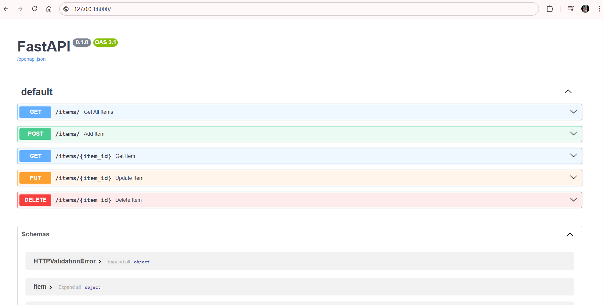

# 🗃️ FastAPI Inventory Management API

A simple FastAPI-based inventory API that allows you to:

- ➕ Add items
- 📋 View all items
- ✏️ Update items
- ❌ Delete items

## 🚀 Features

| Method | Endpoint            | Description                  |
|--------|---------------------|------------------------------|
| POST   | /items/             | Add a new item               |
| GET    | /items/             | Get all items                |
| GET    | /items/{item_id}    | Get single item              |
| PUT    | /items/{item_id}    | Update item                  |
| DELETE | /items/{item_id}    | Delete item                  |

## 📸 Screenshots

### Swagger UI



## 🛠 Tech Stack

- 🐍 Python
- ⚡ FastAPI
- 🧪 Pydantic
- 🔁 Uvicorn

## 🧪 Running the Project

1. Create a virtual environment:
   ```bash
   python -m venv venv
   source venv/bin/activate  # or venv\Scripts\activate on Windows
